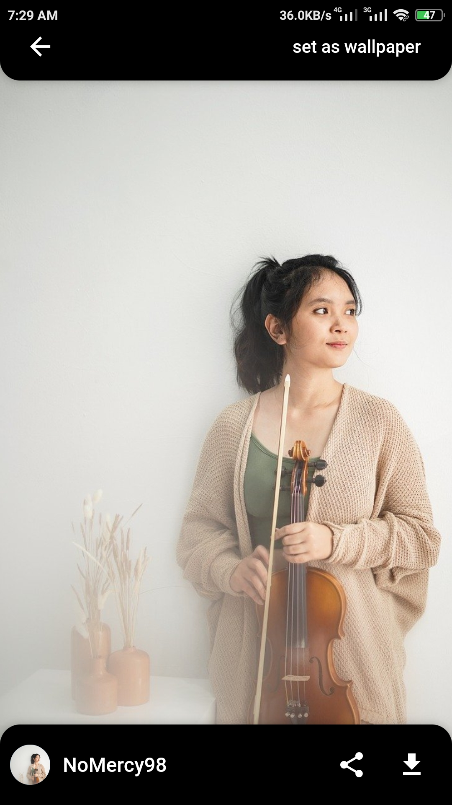

<h1 align="center">Flutter Wallpaper Application</h1>

  <strong>Built with Flutter, Bloc, and APi from pixabay
  </strong>

  Please star⭠the repo if you like what you see😉.

## 💻 Requirements

- Any Operating System (ie. MacOS X, Linux, Windows)
- Any IDE with Flutter SDK installed (ie. IntelliJ, Android Studio, VSCode etc)
- A little knowledge of Dart and Flutter

## 📸 ScreenShots

<!--  -->

                                                                          
| ------------------------------------ | ------------------------------------ |
|   |   |
|   |   |

